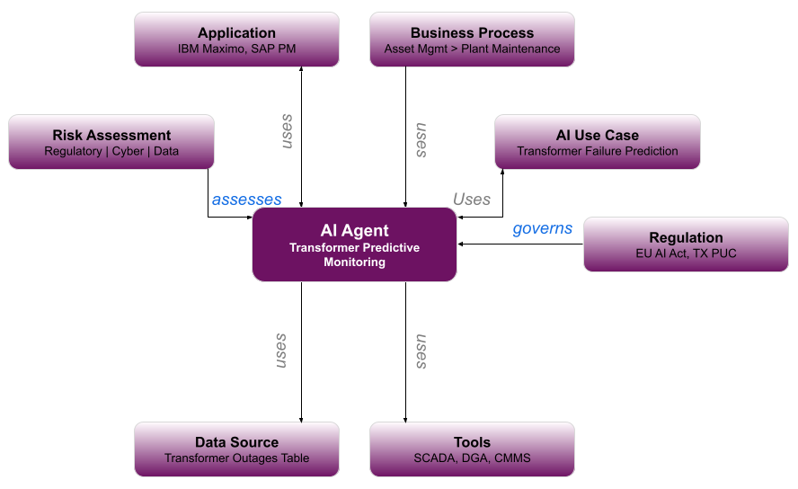

# Applying the Agent Metadata Specification to the Utilities Industry – Prediction of Transformer Failures

## Introduction

The cross-industry Agent Metadata Specification is published [here](https://github.com/TavroOrg/Agent-Metadata-Specification/tree/main/assets/Publications). This section provides an example that combines all the relevant artifacts for the utilities industry.

## Conceptual Model

An overall conceptual model for the use case is shown in Figure 1.

  
   
  <em>Figure 1: Conceptual model for predictive monitoring of transformers in the utilities industry</em>

This example covers the following artifacts (see Table 1):

<table align="center">
  <thead>
    <tr>
      <th><b>Artifact</b></th>
      <th><b>Description</b></th>
    </tr>
  </thead>
  <tbody>
    <tr>
      <td>1. AI Use Case</td>
      <td><ul><li>Prediction of Transformer Failures</li></ul></td>
    </tr>
    <tr>
      <td>2. Agent</td>
      <td><ul><li>Transformer Predictive Monitoring</li></ul></td>
    </tr>
    <tr>
      <td>3. Data Sources</td>
      <td><ul><li>Transformer Outages Table</li></ul></td>
    </tr>
    <tr>
      <td>4. Tools</td>
      <td>
        <ul>
          <li>SCADA / Real-Time Sensor Data Integration Tool</li>
          <li>Dissolved Gas Analysis (DGA) Diagnostic Tool</li>
          <li>Computerized Maintenance Management System (CMMS) Integration Tool</li>
        </ul>
      </td>
    </tr>
    <tr>
      <td>5. Applications</td>
      <td>
        <ul>
          <li>IBM Maximo</li>
          <li>SAP Plant Maintenance</li>
        </ul>
      </td>
    </tr>
    <tr>
      <td>6. Business Processes</td>
      <td><ul><li>Enterprise Asset Management</li></ul></td>
    </tr>
    <tr>
      <td>7. Regulations</td>
      <td>
        <ul>
          <li>EU AI Act Article 6</li>
          <li>Public Utility Commission of Texas / Texas Administrative Code §25.52 - Reliability and Continuity of Service</li>
          <li>Public Utility Commission of Texas / Texas Administrative Code §25.94 - Report on Infrastructure Improvement and Maintenance</li>
        </ul>
      </td>
    </tr>
    <tr>
      <td>8. Agent Risk Assessments</td>
      <td>
        <ul>
          <li>Regulatory Risk Assessment</li>
          <li>Cybersecurity Risk Assessment</li>
          <li>Data Risk Assessment</li>
          <li>Overall Risk Assessment</li>
        </ul>
      </td>
    </tr>
  </tbody>
</table>

  <em>Table 1: Agent metadata artifacts for predictive monitoring of transformers in the utilities industry</em>

### 1. AI Use Case – Prediction of Transformer Failures

The use case leverages 30 years of historical transformer failure data to proactively identify equipment at risk of outage, supporting operational continuity in critical energy infrastructure. The business objective is to shift from reactive repair to predictive intervention - reducing downtime costs, extending asset life, and ensuring reliability across the electrical grid.

### 2. Agent - Transformer Predictive Monitoring

The agent uses 30 years of transformer failure and operational data to conduct predictive maintenance assessments. It analyzes real-time and historical monitoring signals to determine whether a transformer is at risk of failure, identify potential root causes, assess compliance with maintenance standards, and provide remediation recommendations. Each assessment concludes with a risk rating on a scale of 1 (Critical) to 5 (Healthy).

The agent follows a strict five-step process:

1. Analyze historical and current monitoring data (load, temperature, DGA, moisture, maintenance history, outage records)
2. Summarize the transformer's current condition in three sentences
3. Identify positive indicators (what is working well)
4. Flag risks or gaps (what is missing or concerning)
5. Rate the transformer's risk level on the 1-5 scale

Key behavioral guardrails include: no storage or display of sensitive operational identifiers beyond transformer ID, no fabrication of missing data, no attribution of blame to personnel, and strict reliance on provided data only.

### 3. Data Source - Transformer Outages Table

The agent accesses the **Transformer Outages** table, with read access to the following columns (see Table 2):

<table align="center">
  <thead>
    <tr>
      <th><b>Column Name</b></th>
      <th><b>Description</b></th>
    </tr>
  </thead>
  <tbody>
    <tr>
      <td>transformer_id</td>
      <td>Unique transformer identifier</td>
    </tr>
    <tr>
      <td>transformer_serial_number</td>
      <td>Serial number</td>
    </tr>
    <tr>
      <td>transformer_type</td>
      <td>Equipment classification</td>
    </tr>
    <tr>
      <td>model_number</td>
      <td>Asset identity</td>
    </tr>
    <tr>
      <td>installation_date</td>
      <td>Age of asset</td>
    </tr>
    <tr>
      <td>substation_id / location</td>
      <td>Physical deployment context</td>
    </tr>
    <tr>
      <td>load_percentage</td>
      <td>Operational load vs. capacity</td>
    </tr>
    <tr>
      <td>oil_temperature / winding_temperature</td>
      <td>Thermal health indicators</td>
    </tr>
    <tr>
      <td>ambient_temperature</td>
      <td>Environmental context</td>
    </tr>
    <tr>
      <td>last_maintenance_date / maintenance_type</td>
      <td>Maintenance currency</td>
    </tr>
    <tr>
      <td>maintenance_notes / component_replaced</td>
      <td>Maintenance history</td>
    </tr>
    <tr>
      <td>outage_date / outage_event_id</td>
      <td>Historical outage record</td>
    </tr>
    <tr>
      <td>outage_duration_hours</td>
      <td>Outage impact</td>
    </tr>
    <tr>
      <td>failure_type / root_cause</td>
      <td>Failure pattern data</td>
    </tr>
    <tr>
      <td>predicted_failure_probability</td>
      <td>ML-derived risk signal</td>
    </tr>
    <tr>
      <td>risk_score / alert_status</td>
      <td>Current risk indicators</td>
    </tr>
    <tr>
      <td>maintenance_recommendation</td>
      <td>Suggested actions</td>
    </tr>
    <tr>
      <td>remaining_useful_life_days</td>
      <td>Asset longevity estimate</td>
    </tr>
    <tr>
      <td>repair_cost / downtime_cost</td>
      <td>Financial impact tracking</td>
    </tr>
    <tr>
      <td>technician_id</td>
      <td>Maintenance personnel reference</td>
    </tr>
    <tr>
      <td>timestamp</td>
      <td>Data currency</td>
    </tr>
  </tbody>
</table>

  <em>Table 2: Sample columns in the Transformer Outages table</em>

### 4. Tools

The Transformer Predictive Monitoring Agent may use the following tools (see Table 3):

<table align="center">
  <thead>
    <tr>
      <th><b>Tool</b></th>
      <th><b>Description</b></th>
    </tr>
  </thead>
  <tbody>
    <tr>
      <td>SCADA / Real-Time Sensor Data Integration Tool</td>
      <td>A Supervisory Control and Data Acquisition (SCADA) integration tool would allow the agent to ingest live operational readings - such as load percentage, winding temperature, voltage, and current - directly from field sensors and substation monitoring systems. This would enhance the agent's predictive accuracy by supplementing historical outage records with real-time telemetry, enabling faster detection of anomalous conditions before they escalate to failure. Without this tool, the agent relies solely on recorded data, which may lag behind actual equipment conditions.</td>
    </tr>
    <tr>
      <td>Dissolved Gas Analysis (DGA) Diagnostic Tool</td>
      <td>A specialized DGA interpretation tool would enable the agent to automatically classify gas concentration patterns (e.g., elevated acetylene, hydrogen, or methane) against known fault signatures like thermal degradation or partial discharge. This would elevate the agent's diagnostic capability from simple threshold checking to pattern-based fault type identification, significantly improving the specificity of maintenance recommendations.</td>
    </tr>
    <tr>
      <td>Computerized Maintenance Management System (CMMS) Integration Tool</td>
      <td>A CMMS integration tool - connecting to platforms like IBM Maximo or SAP Plant Maintenance - would allow the agent to both read and write maintenance records, pulling current work order status and maintenance history while also triggering new work orders when risk thresholds are breached. This closes the loop between predictive insight and operational action, ensuring that agent-generated recommendations result in scheduled maintenance activities rather than residing only in a report.</td>
    </tr>
  </tbody>
</table>

  <em>Table 3: Tools used by the transformer predictive monitoring agent</em>

### 5. Applications - IBM Maximo / SAP Plant Maintenance

The agent reads and writes maintenance history and recommendations to and from **IBM Maximo** and **SAP Plant Maintenance**.

### 6. Business Process

The agent is used by the **Asset Management** business process with a sub-process relating to **Plan Maintenance**.

### 7. Regulations

Regulatory requirements impacting this use case are summarized in Table 4:

<table align="center">
  <thead>
    <tr>
      <th><b>Regulation</b></th>
      <th><b>Requirement</b></th>
      <th><b>Description</b></th>
    </tr>
  </thead>
  <tbody>
    <tr>
      <td>EU AI Act</td>
      <td>Article 6</td>
      <td>Covers High-Risk AI Systems.</td>
    </tr>
    <tr>
      <td>Public Utility Commission of Texas / Texas Administrative Code</td>
      <td>§25.52 - Reliability and Continuity of Service</td>
      <td>Requires every utility to make all reasonable efforts to prevent interruptions of service and, when interruptions do occur, to reestablish service within the shortest possible time.</td>
    </tr>
    <tr>
      <td>Public Utility Commission of Texas / Texas Administrative Code</td>
      <td>§25.94 - Report on Infrastructure Improvement and Maintenance</td>
      <td>Requires electric utilities to file reports on infrastructure improvement and maintenance.</td>
    </tr>
  </tbody>
</table>

  <em>Table 4: Regulations governing the AI use case and agent</em>

### 8. Agent Risk Assessment

The Agent Risk Assessment is broken down into two components:

#### 8.1 Regulatory Risk Assessment

The agent is flagged under **Critical Infrastructure** (electricity supply), which triggers a **High Risk** regulatory classification under Article 6 of the EU AI Act.

#### 8.2 Cybersecurity Risk Assessment

The OWASP AI Vulnerability Scoring System (AIVSS) Capability Breakdown is 4.0/10 as shown in Table 5.

<table align="center">
  <thead>
    <tr>
      <th><b>Capability</b></th>
      <th><b>Score</b></th>
      <th><b>Summary</b></th>
    </tr>
  </thead>
  <tbody>
    <tr>
      <td>Autonomy of Action</td>
      <td>0.0</td>
      <td>Strictly step-by-step; no autonomous execution</td>
    </tr>
    <tr>
      <td>Goal-Driven Planning</td>
      <td>0.5</td>
      <td>Multi-step task decomposition; no delegation</td>
    </tr>
    <tr>
      <td>Self-Modification</td>
      <td>0.0</td>
      <td>No ability to alter its own logic or instructions</td>
    </tr>
    <tr>
      <td>Dynamic Tool Use</td>
      <td>1.0</td>
      <td>No explicit tool use documented</td>
    </tr>
    <tr>
      <td>Memory Use</td>
      <td>1.0</td>
      <td>No memory mechanism documented</td>
    </tr>
    <tr>
      <td>Contextual Awareness</td>
      <td>1.0</td>
      <td>No contextual awareness mechanism documented</td>
    </tr>
    <tr>
      <td>Dynamic Identity</td>
      <td>0.0</td>
      <td>Static permissions; no role or identity changes</td>
    </tr>
    <tr>
      <td>Multi-Agent Interactions</td>
      <td>0.0</td>
      <td>No peer agent communication</td>
    </tr>
    <tr>
      <td>Non-Determinism</td>
      <td>0.5</td>
      <td>Fixed output format with some natural language flexibility</td>
    </tr>
    <tr>
      <td>Opacity &amp; Reflexivity</td>
      <td>0.0</td>
      <td>Fully auditable, stepwise output with explicit rationale</td>
    </tr>
  </tbody>
</table>

  <em>Table 5: OWASP AIVSS capability breakdown</em>

#### 8.3 Data Risk Assessment

The agent does not access Personally Identifiable Information (PII), Protected Health Information (PHI), or Payment Card Industry (PCI) data.

#### 8.4 Overall Agent Risk Assessment

The Transformer Predictive Monitoring agent is a well-constrained, single-purpose AI agent operating in a critical infrastructure context. Its technical risk profile is medium - it follows deterministic logic, accesses only operational transformer data with no sensitive personal data exposure and has no autonomous execution capabilities. The elevated regulatory risk classification is driven entirely by its deployment in the electricity supply sector under EU AI Act Article 6, not by any inherent technical vulnerability. Governance focus should center on ensuring continued compliance with critical infrastructure obligations and maintaining transparency in its predictive outputs.

## Contributors

[Raj Arumugam, Entergy](https://www.linkedin.com/in/rajarajan-arumugam/)
