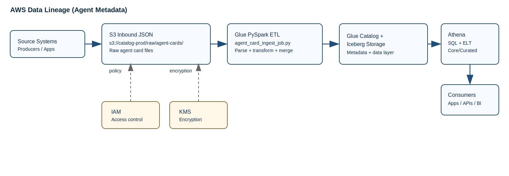

# Architecture

## Core stack

- **Amazon S3** as the storage layer for Iceberg data and table files (`s3://catalog-prod/iceberg/...`)
- **AWS Glue Data Catalog** as the metastore for all databases and tables:
  - `catalog_raw`
  - `catalog_core`
  - `catalog_curated`
- **AWS Glue (PySpark jobs)** for ingestion and transformation workloads
- **Amazon Athena** for SQL execution (DDL + ELT transforms + analytics queries)
- **AWS IAM + AWS KMS** for access control and encryption
- **AWS CloudWatch** for job/query observability and operational monitoring

## Execution flow in AWS

1. **Ingest from S3**
- Source JSON metadata files land in S3 input prefixes (for example `s3://catalog-prod/inbound/agent-cards/`).
- Glue PySpark job [`agent_card_ingest_job.py`](/d:/Github - Tavro/Agent-Metadata-Specification/reference_imlementation/etl/agent_card_ingest_job.py) discovers JSON files directly from S3 (no SQS dependency).
- The job parses and transforms payloads, then performs `MERGE INTO` upserts into `catalog_core.agents` (Iceberg).

2. **Standardize to Core**
- Additional Glue/Athena transforms can read raw or inbound-aligned datasets and populate remaining `catalog_core` entities (tools, models, risk, governance, etc.).

3. **Publish Curated Views**
- Athena SQL jobs aggregate/join core entities into analytics-ready `catalog_curated` tables (for example `agent_360`, `agent_risk_dashboard`).

4. **Consume**
- Admin UI, APIs, and analytics consumers query Athena against curated/core tables via Glue Catalog metadata.
- Access is controlled by IAM policies; data is encrypted with KMS.

## Lineage diagram

## Design principles

- Metadata-first model for agent governance and observability
- Layered data architecture with direct, file-based ingestion into Iceberg
- AWS-native, serverless query pattern using Athena + Glue + S3
- Clear separation of ingestion (Glue), modeling (core/curated), and consumption
- Portable Iceberg-based layout for future interoperability and external sharing
